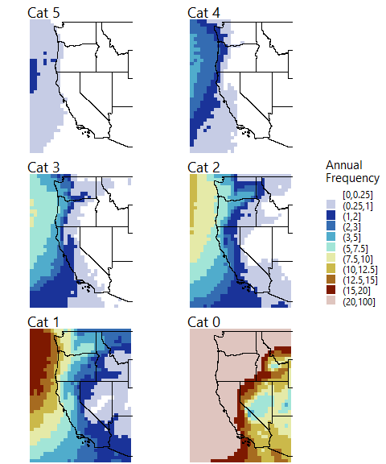

# MERRA-2 Data

This folder contains code to retrieve integrated water vaport transport
(IVT) and precipitation data from the Modern-Era Retrospective Analysis
for Research and Applications, Version 2 (MERRA-2) by the National
Aeronautics and Space Agency (NASA) [1].

Within the `ivt` folder, the file `get_ivt_ar.Rdata` downloads IVT data
that were calculated by Jonathan Rutz as a function of wind speed and
specific humidity [2]. Data are available at
<ftp://sioftp.ucsd.edu/CW3E_DataShare/Rutz_AR_Catalog>. The file
`ar_freq_by_cat.R` creates the figure below, which replicates Fig. 6
from Ralph et al. (2019) [3] to ensure that the data were loaded and
transformed correctly.

Precipitation data are available from the Goddard Earth Sciences Data
and Information Services Center (GES DISC) at
<https://disc.gsfc.nasa.gov/>. Within the `precip` folder, the file
`get_precipitation.Rmd` contains instructions for download and processes
data for the study area.

  

[1] Gelaro, R., McCarty, W., Suárez, M. J., Todling, R., Molod, A.,
Takacs, L., Randles, C. A., Darmenov, A., Bosilovich, M. G., Reichle,
R., Wargan, K., Coy, L., Cullather, R., Draper, C., Akella, S., Buchard,
V., Conaty, A., da Silva, A. M., Gu, W., Kim, G.-K., Koster, R.,
Lucchesi, R., Merkova, D., Nielsen, J. E., Partyka, G., Pawson, S.,
Putman, W., Rienecker, M., Schubert, S. D., Sienkiewicz, M., & Zhao, B.
(2017). The Modern-Era Retrospective Analysis for Research and
Applications, Version 2 (MERRA-2). Journal of Climate, 30(14),
5419–5454. <https://doi.org/10.1175/JCLI-D-16-0758.1>.

[2] Rutz, J. J., Steenburgh, W. J., & Ralph, F. M. (2014).
Climatological characteristics of atmospheric rivers and their inland
penetration over the western United States. Monthly Weather Review,
142(2), 905–921. <https://doi.org/10.1175/MWR-D-13-00168.1>.

[3] Ralph, F. M., Rutz, J. J., Cordeira, J. M., Dettinger, M. D.,
Anderson, M., Reynolds, D., Schick, L. J., & Smallcomb, C. (2019). A
scale to characterize the strength and impacts of atmospheric rivers.
Bulletin of the American Meteorological Society, 100(2), 269–289.
<https://doi.org/10.1175/BAMS-D-18-0023.1>.
